# *Auto Mobile Insurance MachineLearning notebooks Using Python Language*

👩‍💻 I'm currently working on...


## *Author  [Omar Soub](https://github.com/omars1234)*

[](https://github.com/omars1234/R-Programming_AutoMobileInusranceAnalysis)

## *Overview*


*In this Project ,we will use Python Language and find the best Machine Learning Models with hypert parameter tuning for classificationa and regression problems*

* *For detailed data analysis , you can see [https://github.com/omars1234/R-Programming_AutoMobileInusranceAnalysis](https://github.com/omars1234/R-Programming_AutoMobileInusranceAnalysis) where we have aplplied deep Analysis using R-Programming ,or you can access the project online on Rpubs Web [*AutoMobilePricesAnalysis-http://rpubs.com/omars/1207895*](http://rpubs.com/omars/1208635)* 

## *Table of Contents*

*  *Installation*  
*  *Data*  
*  *Usage*  
*  *Project Structure*  
*  *Models and Parameters used in hypert tuning*  
*  *Results*  

## *Installation*  
*To run this project, you need to have Python installed on your machine. Additionally, install the required libraries by running the following libraries on requirements.txt file:*

```bash
pandas
numpy
matplotlib
seaborn
datetime
plotly
statsmodels
scikit-learn
plotnine
scipy
boruta
streamlit
xgboost
tqdm
plotclassification
yellowbrick
ipykernel
imblearn
nbformat
graphviz
hyperopt
```

## *Data*  
*The dataset used for this project contains AutoMobile Insurance data. It includes the following columns:*


*veh_value : The AutoMobile sum insured*

*exposure : earned exposures*

*clm : claims Incurrence  0:No ,1:yes*

*numclaims : number of claims frequency*

*claimcst0 :  Incurred claims cost*

*veh_body : BUS,SEDAN,COUPE,HBACK...etc.*

*veh_age : 1,2,3,4*

*gender : F : Female , M : male*

*area : A,B,C,D,E,F*

*agecat : 1,2,3,4,5,6*


## *Usage*

*Clone the repository:*


```bash
https://github.com/omars1234/Insurance_Analysis.git
```

## *Project Structure*


```bash
AUTO_INSURANCE/
├── Data/
│   └── data_car.csv
├── Notebooks/
│   ├── Data_Analysis
|          ├── 1_DataImporting.ipynb
|          ├── 2_EDA.ipynb
|   ├── Data_Classification
|          ├── agecat_classification.ipynb
|          ├── area_classification.ipynb
|          ├── gender_classification.ipynb
|          ├── veh_body_classification.ipynb
|   ├── Data_Regression
|          ├── Claims_Regression.ipynb
|   
├── outcomes/
|   ├── bestModels
|   ├── bestParams
|   ├── ConfusionMatrixGraphs 
|   ├── featuresImportanceGraphs
|   ├── modelsEvaluations
|   ├── modelsEvaluationsGraphs
|   ├── ROCcurveGraphs
|
|
├── README.md
├── requiremnts.txt
```

## *Models and Parameters used in hyper tuning*  
### *A. for Regression  ML :*

```bash
models = {
        "RandomForestRegressor": RandomForestRegressor(),
        "DecisionTreeRegressor": DecisionTreeRegressor(),
        "XGBRFRegressor": XGBRFRegressor(),
        "GradientBoostingRegressor":GradientBoostingRegressor(),
        "AdaBoostRegressor": AdaBoostRegressor(),
        "KNeighborsRegressor":KNeighborsRegressor()              
}
```

### *B. for Classification ML :*

```bash
models = {
        "XGBRFClassifier": XGBRFClassifier(),
        "GradientBoostingClassifier":GradientBoostingClassifier(),
        "RandomForestClassifier": RandomForestClassifier(),
        "AdaBoostClassifier":AdaBoostClassifier(),
        "DecisionTreeClassifier": DecisionTreeClassifier(),
        "LogisticRegression":LogisticRegression(),
        "SVC":SVC(),
        "KNeighborsClassifier":KNeighborsClassifier()
}
```


## *Results*

### *claims feature  as Regression Target ML :*

* *The best model was GradientBoostingRegressor()as it has the lowest root mean square error*


 *model Evaluations Graph*             |  *Model Features Importance Graphs*
:-------------------------:|:-------------------------:
 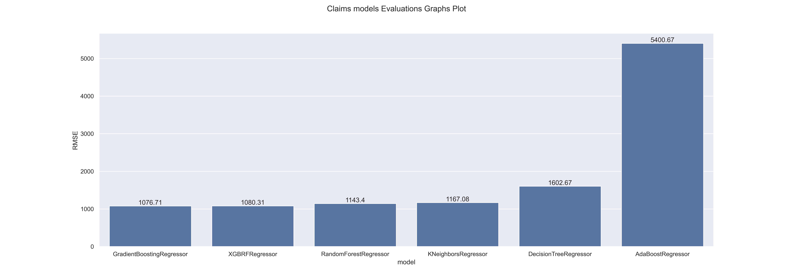  |   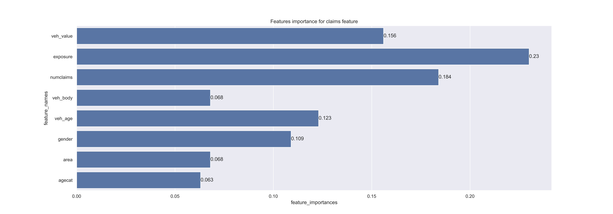


---------------------------------------

### *gender Category as Classification Target ML :*

* *The best model model was RandomForestClassifier() with the default parameters:*

*model Evaluations Graph*            |  *model Confusin Matrix*
:-------------------------:|:-------------------------:
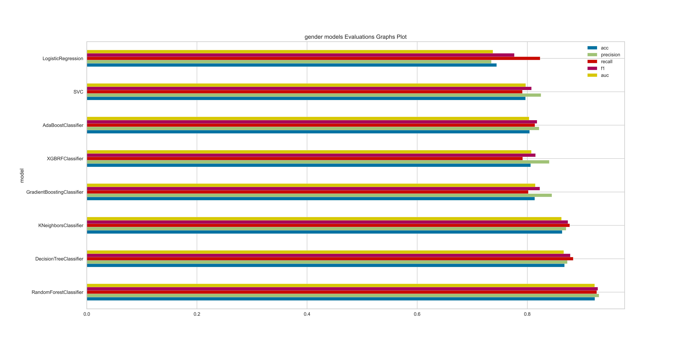  |  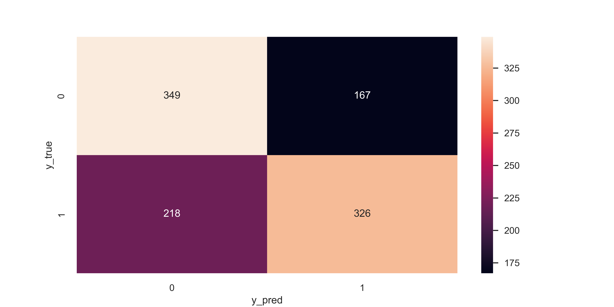

 
*Model ROC curve Graphs*             |  *Model Features Importance Graphs*
:-------------------------:|:-------------------------:
   |   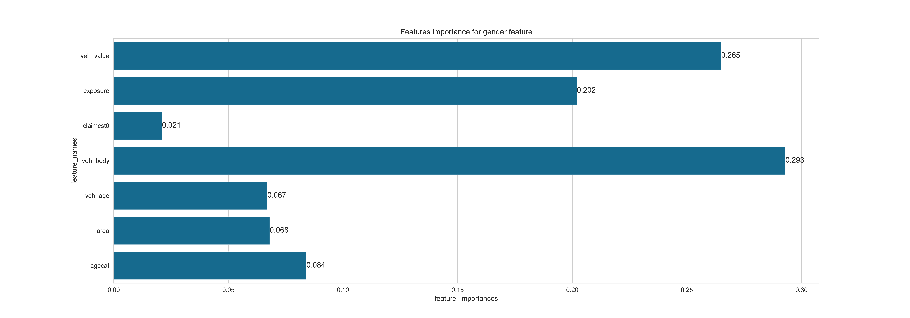


 ---------------------------------------

 ### *veh body Category as Classification Target ML :*

 * *The best model model was RandomForestClassifier() with the default parameters:*


*model Evaluations Graph*             |  *Model Features Importance Graphs*  
:-------------------------:|:-------------------------:
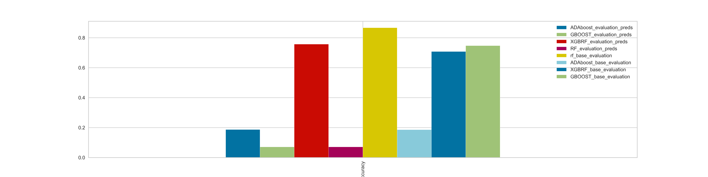  |  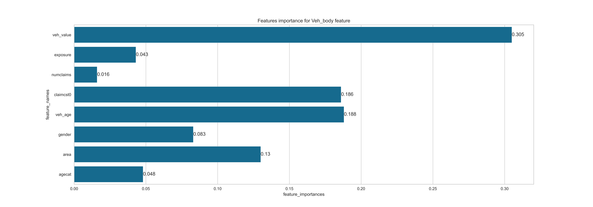

*model Confusin Matrix*
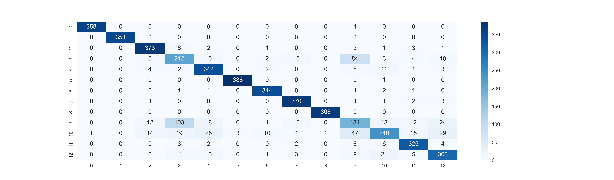
 

 ---------------------------------------

 ### *area Category as Classification Target ML :*

 * *The best model model was RandomForestClassifier() with the default parameters:*


*model Evaluations Graph*             |  *Model Features Importance Graphs*  
:-------------------------:|:-------------------------:
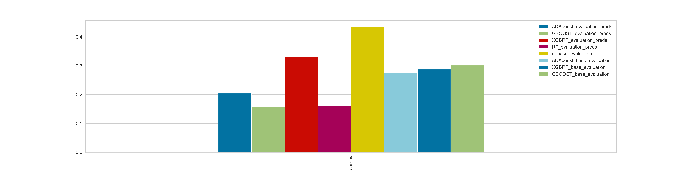  |  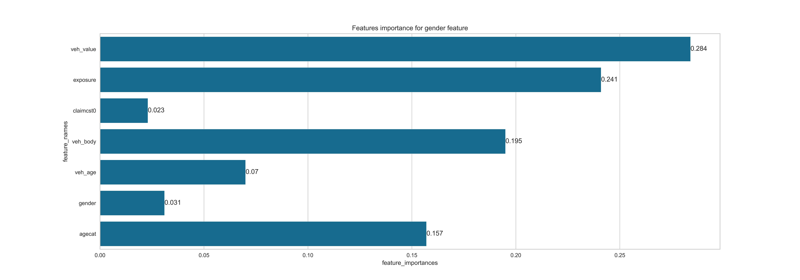

*model Confusin Matrix*
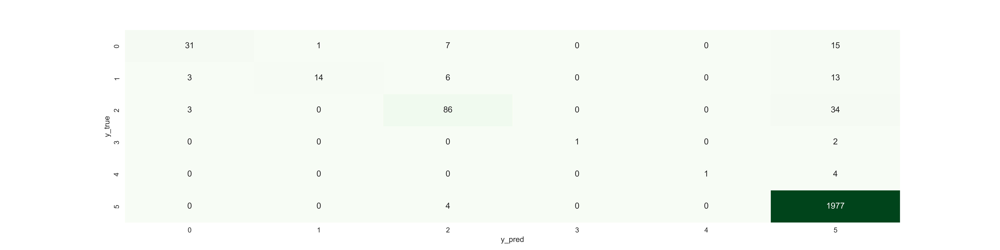
 
 ----------------------------------------

 ### *age category Category as Classification Target ML :*

 * *The best model model was RandomForestClassifier() with the default parameters:*


*model Evaluations Graph*             |  *Model Features Importance Graphs*  
:-------------------------:|:-------------------------:
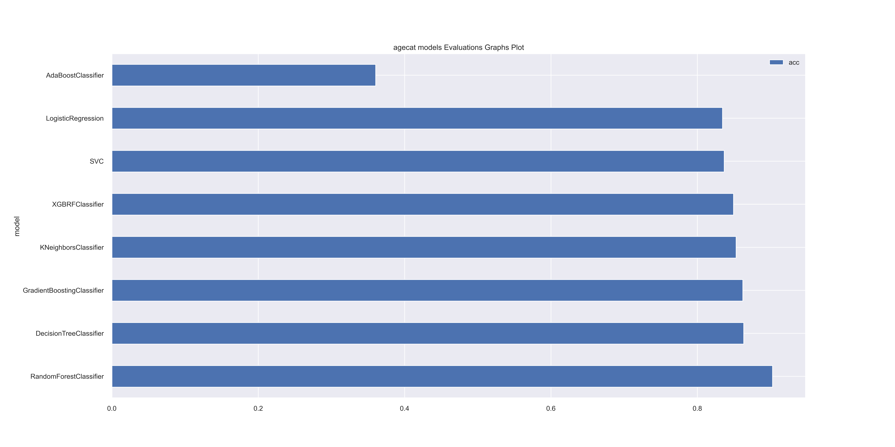  |  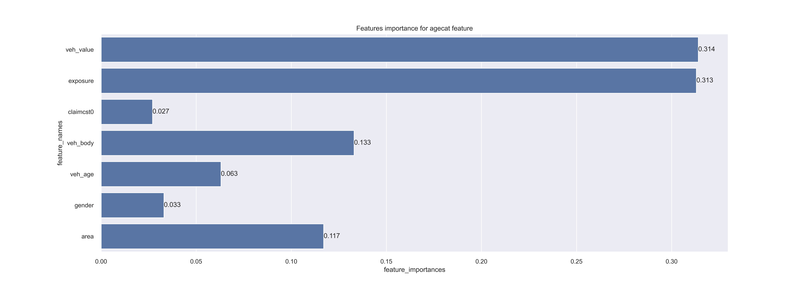

*model Confusin Matrix*
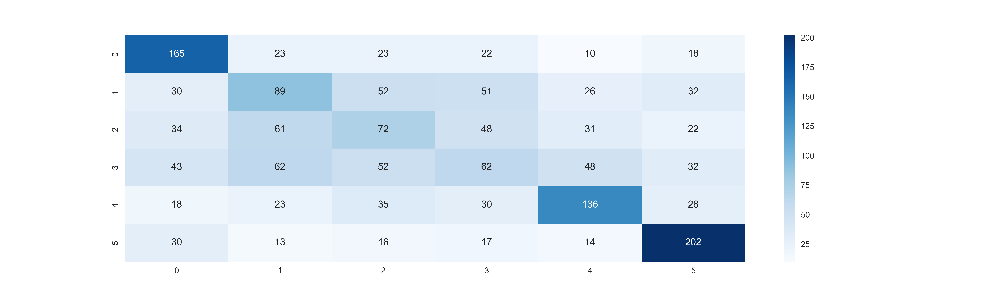
 
 ----------------------------------------

 👩‍💻 I'm currently working on...


* *For detailed data analysis , you can see [https://github.com/omars1234/R-Programming_AutoMobileInusranceAnalysis](https://github.com/omars1234/R-Programming_AutoMobileInusranceAnalysis) where we have aplplied deep Analysis using R-Programming ,or you can access the project online on Rpubs Web [*AutoMobilePricesAnalysis-http://rpubs.com/omars/1207895*](http://rpubs.com/omars/1208635)* 


## *Feedback*

*If you have any feedback, please reach out to us at omars.soub@gmail.com*

## 🔗 Links

[*my github page-https://github.com/omars1234*](https://github.com/omars1234)

## *🛠 Skills*
*python, R, SQL ,PowerBi ,Tableaue*


