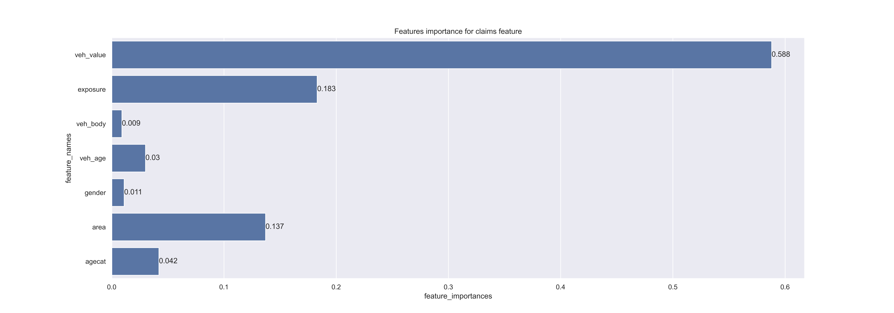

# *Auto Mobile Insurance MachineLearning notebooks Using Python Language*

👩‍💻 I'm currently working on...


## *Author  [Omar Soub](https://github.com/omars1234)*

## *Overview*


*In this Project ,we will use Python Language and find the best Machine Learning Models with hypert parameter tuning for classificationa and regression problems*

## *Table of Contents*

*  *Installation*  
*  *Data*  
*  *Usage*  
*  *Project Structure*  
*  *Models and Parameters used in hypert tuning*  
*  *Results*  

## *Installation*  
*To run this project, you need to have Python installed on your machine. Additionally, install the required libraries by running the following libraries on requirements.txt file:*

```bash
pandas
numpy
matplotlib
seaborn
datetime
plotly
statsmodels
scikit-learn
plotnine
scipy
boruta
streamlit
xgboost
tqdm
plotclassification
yellowbrick
ipykernel
imblearn
nbformat
graphviz
hyperopt
```

## *Data*  
*The dataset used for this project contains AutoMobile Insurance data. It includes the following columns:*


*veh_value : The AutoMobile sum insured*

*exposure : earned exposures*

*clm : claims Incurrence  0:No ,1:yes*

*numclaims : number of claims frequency*

*claimcst0 :  Incurred claims cost*

*veh_body : BUS,SEDAN,COUPE,HBACK...etc.*

*veh_age : 1,2,3,4*

*gender : F : Female , M : male*

*area : A,B,C,D,E,F*

*agecat : 1,2,3,4,5,6*


## *Usage*

*Clone the repository:*


```bash
https://github.com/omars1234/Insurance_Analysis.git
```

## *Project Structure*


```bash
AUTO_INSURANCE/
├── Data/
│   └── data_car.csv
├── Notebooks/
│   ├── Data_Analysis
|          ├── 1_DataImporting.ipynb
|          ├── 2_EDA.ipynb
|   ├── Data_Classification
|          ├── agecat_classification.ipynb
|          ├── area_classification.ipynb
|          ├── gender_classification.ipynb
|          ├── veh_body_classification.ipynb
|   ├── Data_Regression
|          ├── Claims_Regression.ipynb
|   
├── outcomes/
|   ├── bestModels
|   ├── bestParams
|   ├── featuresImportanceGraphs
|   ├── MulticlassROCGraphs
|   ├── ROCcurveGraphs
|
|
├── README.md
├── requiremnts.txt
```

## *Models and Parameters used in hyper tuning*  
### *A. for Regression  ML :*

```bash
models = {
                "RandomForestRegressor": RandomForestRegressor(),
                "DecisionTreeRegressor": DecisionTreeRegressor(),
                "XGBRFRegressor": XGBRFRegressor(),
                "GradientBoostingRegressor":GradientBoostingRegressor(),
                "AdaBoostRegressor": AdaBoostRegressor()
}

search_spaces ={        
        "XGBRFRegressor":{
            "learning_rate": hp.uniform("learning_rate",0.01,1.0),   
            "max_depth": hp.choice("max_depth", [2, 4, 5, 6,7,8]),
            "subsample": hp.uniform("subsample",0.5,1.0),
            "n_estimators": hp.choice("n_estimators", [100, 200, 300, 400,500,600]),
            'colsample_bytree': hp.uniform("colsample_bytree",0.5,1.0), 
            'colsample_bynode': hp.uniform("colsample_bynode",0.5,1.0),
            "reg_lambda": hp.quniform("reg_lambda",0,2,1),         
            "reg_alpha": hp.quniform("reg_alpha",0,2,1),
            "num_parallel_tree": hp.choice("num_parallel_tree", [100,110])
            },                    
        "GradientBoostingRegressor":{
            "loss": hp.choice("loss",['squared_error', 'huber', 'absolute_error', 'quantile']),
            "n_estimators": hp.choice("n_estimators", [100, 200, 300, 400,500,600]),
            "max_depth": hp.choice("max_depth", [2, 4, 5, 6,7,8]),
            "max_features": hp.choice("max_features",["sqrt", "log2"]),
            "learning_rate": hp.uniform("learning_rate",0.01,1.0),
            "subsample": hp.uniform("subsample",0.8,1.0),
            "min_samples_split": hp.uniform("min_samples_split",0.8,1.0),
            "min_samples_leaf": hp.uniform("min_samples_leaf",0.8,1.0),
            "criterion": hp.choice("criterion",["squared_error", "friedman_mse"]) 
            },
        "RandomForestRegressor":{
            "n_estimators": hp.choice("n_estimators", [100, 200, 300, 400,500,600]), 
            "min_samples_split": hp.uniform("min_samples_split",0.8,1.0),
            "min_samples_leaf": hp.uniform("min_samples_leaf",0.8,1.0),
            "bootstrap": hp.choice("bootstrap",[True, False]),                                                                                                    
            "max_features": hp.choice("max_features",["sqrt", "log2"]),                                    
            "max_depth": hp.choice("max_depth", [2, 4, 5, 6,7,8]),
            "criterion": hp.choice("criterion",["poisson", "squared_error", "friedman_mse","absolute_error"])                    
            },
        "AdaBoostRegressor":{
            "n_estimators": hp.choice("n_estimators", [100, 200, 300, 400,500,600]),
            "learning_rate": hp.uniform("learning_rate",0.01,1.0),
            "loss": hp.choice("loss",["linear","square","exponential"])
            },
        "DecisionTreeRegressor": {
                    "criterion": hp.choice("criterion",["poisson", "squared_error", "friedman_mse","absolute_error"]),
                    'splitter': hp.choice("splitter",["best", "random"]),
                    "max_depth": hp.choice("max_depth", [2, 4, 5, 6,7,8]),
                    "min_samples_split": hp.uniform("min_samples_split",0.8,1.0),
                    "min_samples_leaf": hp.uniform("min_samples_leaf",0.8,1.0),
                    "max_features": hp.choice("max_features",["sqrt", "log2"])
            }                    
}
```

### *B. for Classification ML :*

```bash
models = {
        
        "XGBRFClassifier": XGBRFClassifier(),
        "GradientBoostingClassifier":GradientBoostingClassifier(),
        "RandomForestClassifier": RandomForestClassifier(),
        "AdaBoostClassifier":AdaBoostClassifier(),
        "DecisionTreeClassifier": DecisionTreeClassifier(),
}

search_spaces ={        
        "XGBRFClassifier":{
            "learning_rate": hp.uniform("learning_rate",0.01,1.0),    # 0.3 is the default
            "max_depth": hp.choice("max_depth", [2, 4, 5, 6,7,8]),
            "subsample": hp.uniform("subsample",0.5,1.0),
            "n_estimators": hp.choice("n_estimators", [100, 200, 300, 400,500,600]),
            'colsample_bytree': hp.uniform("colsample_bytree",0.5,1.0), 
            'colsample_bynode': hp.uniform("colsample_bynode",0.5,1.0),
            "reg_lambda": hp.quniform("reg_lambda",0,2,1),
            "reg_alpha": hp.quniform("reg_alpha",0,2,1)
            },
        "GradientBoostingClassifier":{
            "n_estimators": hp.choice("n_estimators", [100, 200, 300, 400,500,600]),
            "max_depth": hp.choice("max_depth", [2, 4, 5, 6,7,8]),
            "max_features": hp.choice("max_features",["sqrt", "log2"]),
            "learning_rate": hp.uniform("learning_rate",0.01,1.0),
            "subsample": hp.uniform("subsample",0.8,1.0),
            "min_samples_split": hp.uniform("min_samples_split",0.8,1.0),
            "min_samples_leaf": hp.uniform("min_samples_leaf",0.8,1.0)
            },
        "RandomForestClassifier":{
            "n_estimators": hp.choice("n_estimators", [100, 200, 300, 400,500,600]), 
            "min_samples_split": hp.uniform("min_samples_split",0.8,1.0),
            "min_samples_leaf": hp.uniform("min_samples_leaf",0.8,1.0),
            "bootstrap": hp.choice("bootstrap",[True, False]),                                                                                                    
            "max_features": hp.choice("max_features",["sqrt", "log2"]),                                    
            "max_depth": hp.choice("max_depth", [2, 4, 5, 6,7,8]),
            "criterion": hp.choice("criterion",["gini", "entropy", "log_loss"])                    
            },
        "AdaBoostClassifier":{
            "n_estimators": hp.choice("n_estimators", [100, 200, 300, 400,500,600]),
            "learning_rate": hp.uniform("learning_rate",0.01,1.0)
            },
        "DecisionTreeClassifier": {
                    "criterion": hp.choice("criterion",["gini", "entropy", "log_loss"]),
                    'splitter': hp.choice("splitter",["best", "random"]),
                    "max_depth": hp.choice("max_depth", [2, 4, 5, 6,7,8]),
                    "min_samples_split": hp.uniform("min_samples_split",0.8,1.0),
                    "min_samples_leaf": hp.uniform("min_samples_leaf",0.8,1.0),
                    "max_features": hp.choice("max_features",["sqrt", "log2"])
            }      
}

```


## *Results*

### *Claims Cost as Regression Target ML :*

* *The best model model was XGBRFRegressor() with the below parameters :*

```bash
{   'colsample_bynode': np.float64(0.6791101907602755),  
    'colsample_bytree': np.float64(0.7584445299347417),  
    'learning_rate': np.float64(0.8512045639269507),  
    'max_depth': np.int64(5),
    'n_estimators': np.int64(5),
    'num_parallel_tree': np.int64(1),
    'reg_alpha': np.float64(2.0),
    'reg_lambda': np.float64(2.0),
    'subsample': np.float64(0.5533220820592234)  
}
```
* *The Model Features Importance Graphs :*

 


----------------------------------------

 ### *age category as Classidication Target ML :*

 * *The best model model was XGBRFRegressor() with the below parameters :*

```bash
{   'colsample_bynode': np.float64(0.7298327394547517),
    'colsample_bytree': np.float64(0.6566584429466105),
    'learning_rate': np.float64(0.6486512992814588),
    'max_depth': np.int64(5),
    'n_estimators': np.int64(4),
    'reg_alpha': np.float64(1.0),
    'reg_lambda': np.float64(1.0),
    'subsample': np.float64(0.8612804342189735)
}
```
* *The Model Features Importance Graphs :*

 

 ----------------------------------------

 ### *area Category as Classidication Target ML :*

 * *The best model model was XGBRFRegressor() with the below parameters :*

```bash
{   'colsample_bynode': np.float64(0.9129237570607415),
    'colsample_bytree': np.float64(0.9882408165556009),
    'learning_rate': np.float64(0.26863099236411175),
    'max_depth': np.int64(4), 'n_estimators': np.int64(3),
    'num_parallel_tree': np.int64(0),
    'reg_alpha': np.float64(1.0),
    'reg_lambda': np.float64(0.0),
    'subsample': np.float64(0.9132688681733999)
}
```
* *The Model Features Importance Graphs :*

 

 ----------------------------------------

 ### *gender Category as Classidication Target ML :*

 * *The best model model was XGBRFRegressor() with the below parameters :*

```bash
{   'colsample_bynode': np.float64(0.8714994123389928),
    'colsample_bytree': np.float64(0.793153125539062),
    'learning_rate': np.float64(0.691645029296458),
    'max_depth': np.int64(2),
    'n_estimators': np.int64(1),
    'reg_alpha': np.float64(1.0),
    'reg_lambda': np.float64(1.0),
    'subsample': np.float64(0.5030310997926619)
}
```
* *The Model Features Importance Graphs :*

 

 ----------------------------------------

 ### *veh body Category as Classidication Target ML :*

 * *The best model model was XGBRFRegressor() with the below parameters :*

```bash
{   'colsample_bynode': np.float64(0.8242226665175306),
    'colsample_bytree': np.float64(0.8029099521062315),
    'learning_rate': np.float64(0.25726849104466526),
    'max_depth': np.int64(4),
    'n_estimators': np.int64(1),
    'num_parallel_tree': np.int64(0),
    'reg_alpha': np.float64(1.0),
    'reg_lambda': np.float64(1.0),
    'subsample': np.float64(0.7181215732378148)
}
```
* *The Model Features Importance Graphs :*

 

 ----------------------------------------


👩‍💻 I'm currently working on...


